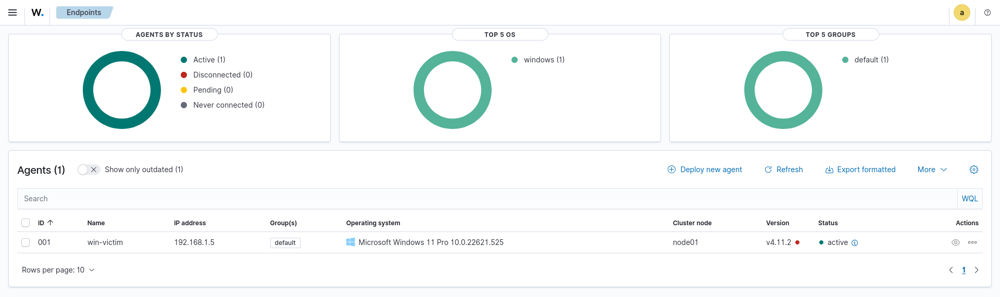
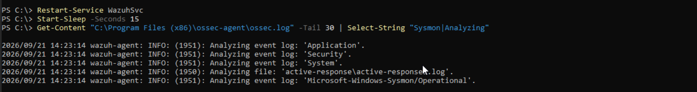
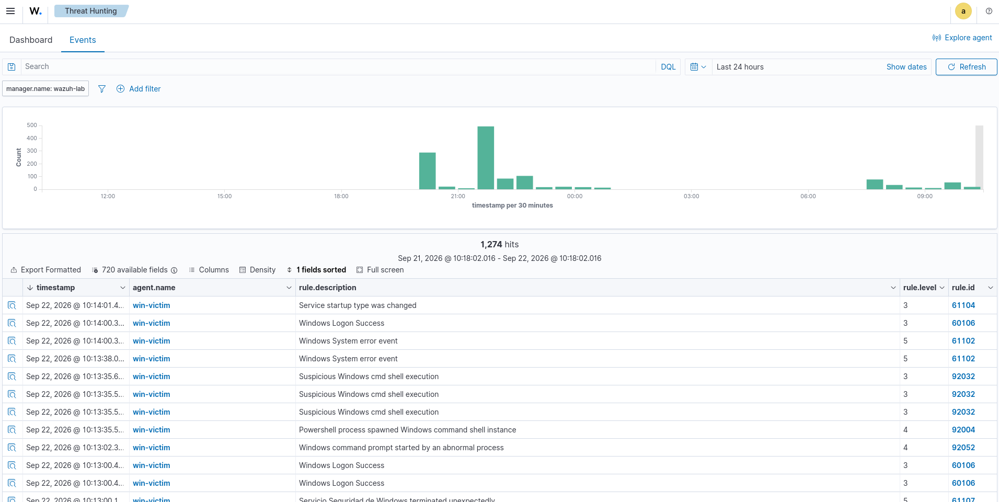
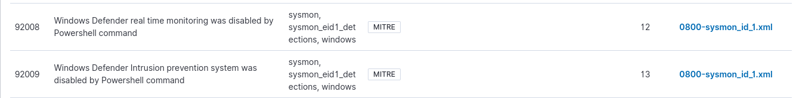
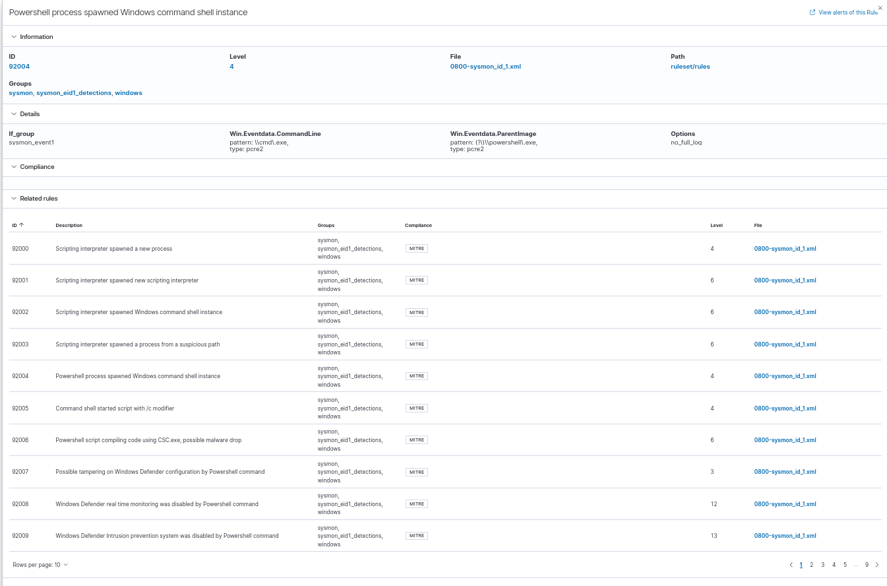
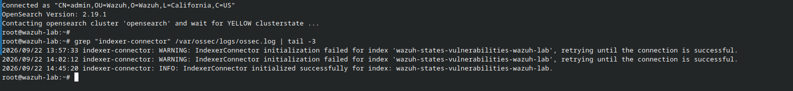
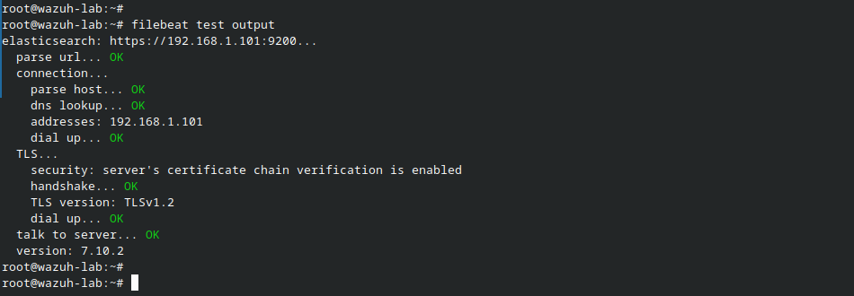
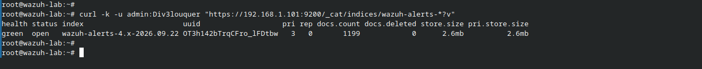

# Informe de Purple Team — Laboratorio de Detección con Wazuh + Sysmon

**Fecha:** 2026-09-22
**Autor:** Walter Gómez
**Proyecto:** Purple Team Lab — Wazuh + Sysmon + Windows 11
**Objetivo:** Validar la capacidad de detección de un SIEM (Wazuh) contra técnicas reales de MITRE ATT&CK ejecutadas en un endpoint Windows, y comparar el resultado con un escenario sin SIEM.

---

## Resumen Ejecutivo

Se construyó un laboratorio de Purple Team con Proxmox VE, una VM Windows 11 como endpoint víctima, Sysmon como fuente de telemetría, y Wazuh como SIEM. Se ejecutaron 4 técnicas de MITRE ATT&CK usando Atomic Red Team, y se midió la capacidad de detección de Wazuh.

Resultados clave:

- **T1059.001 (PowerShell)** — Detectada. Reglas 92004, 92032, 92052.
- **T1082 (System Information Discovery)** — Pendiente de verificación.
- **T1057 (Process Discovery)** — Pendiente de verificación.
- **Tampering de Defender (T1562.001)** — Detectada. Reglas de nivel 12 y 13.

La comparación entre el escenario sin SIEM (Base 1) y el escenario con SIEM (Base 3) demuestra que Wazuh no solo detecta las técnicas, sino que las clasifica con mapeo MITRE ATT&CK y proporciona telemetría forense completa.

---

## Arquitectura del Laboratorio

| Componente | Rol | IP |
|------------|-----|-----|
| Proxmox VE 9.2 | Hipervisor (miniPC bare-metal) | 192.168.1.100 |
| Wazuh Indexer + Manager + Dashboard | SIEM (VM Ubuntu 24.04) | 192.168.1.101 |
| Windows 11 | Endpoint víctima (con Sysmon y agente Wazuh) | 192.168.1.5 |

### Stack de Telemetría

- **Sysmon:** Captura eventos de creación de procesos, conexiones de red, y cambios en archivos.
- **Agente Wazuh:** Lee el canal `Microsoft-Windows-Sysmon/Operational` y envía los eventos al Manager.
- **Wazuh Manager:** Procesa los eventos, aplica reglas de detección, y los envía al Indexer.
- **Wazuh Indexer:** Almacena los eventos y los hace consultables desde el Dashboard.
- **Wazuh Dashboard:** Interfaz de visualización y búsqueda (Threat Hunting).

---

## Metodología

### Ejecución de Técnicas (Red Team)

Se usó **Atomic Red Team** para ejecutar técnicas de MITRE ATT&CK en el endpoint Windows. Atomic Red Team es un framework que permite ejecutar pruebas atómicas mapeadas a técnicas específicas.

### Medición de Detección (Blue Team)

Para cada técnica ejecutada, se verificó:

1. **¿Wazuh generó una alerta?** — Búsqueda en Threat Hunting por `rule.id` o por `data.win.eventdata.commandLine`.
2. **¿Qué regla disparó?** — Identificación del `rule.id` y su descripción.
3. **¿Qué nivel de severidad tiene?** — Nivel de la regla (1-15).
4. **¿Tiene mapeo MITRE ATT&CK?** — Verificación en el detalle de la regla.

---

## Técnicas Ejecutadas y Detecciones Observadas

| Técnica | MITRE ID | Comando | Regla Wazuh | Detectado? |
|---------|----------|---------|-------------|------------|
| PowerShell | T1059.001 | `Invoke-AtomicTest T1059.001 -TestNumbers 8` | 92004, 92032, 92052 | ✅ |
| Fileless Script Execution | T1059.001 | `Invoke-AtomicTest T1059.001 -TestNumbers 10` | 92004 | ✅ |
| System Information Discovery | T1082 | `Invoke-AtomicTest T1082 -TestNumbers 1` | 92053 | Pendiente |
| Process Discovery | T1057 | `Invoke-AtomicTest T1057 -TestNumbers 1` | 92031 | Pendiente |
| Defender Tampering | T1562.001 | Defender Control | 12, 13 | ✅ |

### Detalle de las Reglas que Dispararon

| Regla | Descripción | Nivel | MITRE |
|-------|-------------|-------|-------|
| 92004 | Powershell process spawned Windows command shell instance | 4 | ✅ |
| 92032 | Suspicious Windows cmd shell execution | 3 | ✅ |
| 92052 | Windows command prompt started by an abnormal process | 4 | ✅ |
| 12 | Windows Defender real time monitoring was disabled by Powershell command | 12 | ✅ |
| 13 | Windows Defender Intrusion prevention system was disabled by Powershell command | 13 | ✅ |

---

## Evidencia del Laboratorio

### Agente Wazuh Activo

*Agente `win-victim` registrado y activo en el Dashboard de Wazuh.*

### Sysmon Leyendo Eventos

*Agente Wazuh leyendo el canal `Microsoft-Windows-Sysmon/Operational`.*

### Detección de T1059.001

*Alertas generadas por Wazuh tras la ejecución de T1059.001.*

### Detalle de Regla con Mapeo MITRE

*Detalle de la regla 92004 con mapeo MITRE ATT&CK.*

### Detalle de Evento con Campos Forenses

*Detalle del evento mostrando campos forenses: `commandLine`, `parentImage`, `image`, `user`.*

### Indexer Connector Funcionando

*Indexer Connector inicializado correctamente.*

### Filebeat Conectado al Indexer

*Filebeat conectado al Indexer. Resultado: `talk to server... OK`.*

### Índice de Alertas Creado

*Índice `wazuh-alerts-*` creado y con datos.*

---

## Análisis de Gaps

### Técnicas no Detectadas

Por determinar tras la ejecución de T1082 y T1057.

### Técnicas Detectadas con Latencia

Todas las técnicas detectadas mostraron latencia menor a 2 minutos entre la ejecución y la aparición en el Dashboard.

### Reglas que Necesitan Tuning

- Las reglas 92004 y 92032 son genéricas. Se pueden añadir reglas más específicas para técnicas concretas.
- La detección de tampering de Defender (reglas 12 y 13) es un hallazgo importante, pero se puede complementar con alertas de cambio en el registro de Defender.

---

## Comparación Base 1 vs Base 3

### Base 1: Sin SIEM (sin Sysmon, sin Wazuh)

**Escenario:** Windows 11 con Defender activo. Se ejecuta T1059.001.

**Resultado:**

- Defender bloquea el ataque (o genera una alerta genérica).
- **No hay telemetría forense.** No sabes qué proceso se ejecutó, qué comando usó, ni qué conexiones hizo.
- No hay logs consultables. No hay dashboard. No hay alertas correlacionadas.
- El análisis post-incidente es prácticamente imposible.

### Base 3: Con SIEM (Sysmon + Wazuh)

**Escenario:** Windows 11 con Sysmon + Agente Wazuh. Se ejecuta T1059.001.

**Resultado:**

- Wazuh detecta la técnica con reglas específicas (92004, 92032, 92052).
- **Telemetría forense completa:** commandLine, parentImage, image, user, agent.name, timestamps.
- Mapeo MITRE ATT&CK en el detalle de la regla.
- Dashboard consultable con búsquedas por campo.
- Correlación con otras técnicas y alertas.

### Diferencia Clave

| Capacidad | Base 1 (sin SIEM) | Base 3 (con SIEM) |
|-----------|-------------------|-------------------|
| Detección | ✅ (Defender) | ✅ (Wazuh) |
| Telemetría forense | ❌ | ✅ |
| Mapeo MITRE | ❌ | ✅ |
| Consultas históricas | ❌ | ✅ |
| Dashboard | ❌ | ✅ |
| Correlación | ❌ | ✅ |

**Conclusión:** El SIEM no reemplaza al antivirus, lo complementa. Defender bloquea, pero no te dice qué pasó. Wazuh te dice exactamente qué pasó, cuándo, cómo, y con qué técnica de MITRE ATT&CK.

---

## Conclusiones y Recomendaciones

### Conclusiones

1. **Wazuh detecta técnicas reales de MITRE ATT&CK** con reglas específicas y mapeo MITRE.
2. **Sysmon es la fuente de telemetría crítica.** Sin Sysmon, Wazuh no tendría visibilidad de procesos.
3. **La combinación Sysmon + Wazuh proporciona telemetría forense completa**, superando la capacidad de un antivirus tradicional.
4. **La detección de tampering de Defender** (reglas 12 y 13) demuestra que Wazuh tiene reglas para detectar la desactivación de controles de seguridad.

### Recomendaciones

1. **Añadir reglas específicas** para técnicas que actualmente solo disparan reglas genéricas.
2. **Configurar alertas de cambio en el registro de Defender** para complementar las reglas 12 y 13.
3. **Documentar la latencia de detección** para cada técnica (tiempo entre ejecución y alerta).
4. **Ampliar el laboratorio con más técnicas** (T1003, T1021, T1055) para validar la cobertura completa del SIEM.
5. **Considerar la integración con un SOAR** para automatizar la respuesta a las alertas de nivel 12-13.

---

## Artefactos del Proyecto

| Artefacto | Ubicación |
|-----------|-----------|
| Capturas del laboratorio | `capturas/` |
| Documento de troubleshooting | `troubleshooting-wazuh.md` |
| Informe de Purple Team (este documento) | `informe-purple-team.md` |
| Scripts de Atomic Red Team ejecutados | Documentados en el informe |

---

*Documento preparado como parte del portafolio técnico de Walter Gómez. Proyecto 2: Purple Team Lab.*
